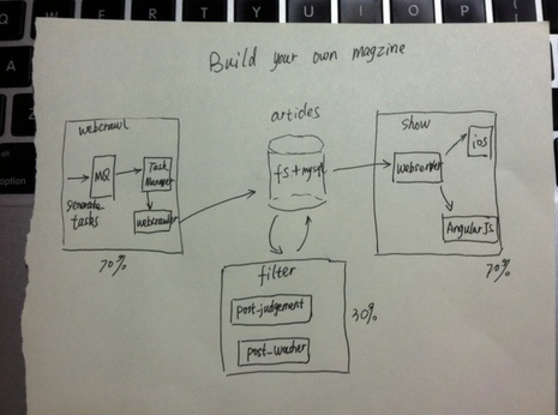

xiaozibao - 小字报
=========
- Monitor the whole internet, to build your personal magzine adjusted by your taste.
- Subscribe to topic, instead of RSS; Read less for more.

  
 

## Join us for free. Why?
- We see the project target to minimize the gap of information age: read less for more
- We see the project is at the early stage.
- We see lots of powerful languages here: Python, Erlang, Golang, Objectc, Anjularjs, Bash,etc.
- We see lots of popluar weapons here: Puppet, Jenkins, Tsung, Zabbix, etc

## How to involve?
Drop me an email: markfilebat@126.com, to join the mail group.

## Installation
- verified on Darwin12.4, ubuntu10.4, centos5.6

| Name                                   | Comment                                                                      |
|:----------------------------------------|------------------------------------------------------------------------------|
| Checkout github                        | https://github.com/DennyZhang/xiaozibao                                       |
| Install mysql-server                   |                                                                              |
| Install mysql-client libmysqlclient-dev|                                                                              |
| Install erlang                         | sudo apt-get install erlang / yum install erlang / brew install erlang
| Install rabbitmq-server                |                                                                              |
| Install google go                      | http://blog.ec-ae.com/?p=7867#sec-1-1                                        |
| Install puppet                         | http://blog.ec-ae.com/?p=2824#sec-1                                          |
| Enforce puppet                         | https://github.com/DennyZhang/xiaozibao/blob/master/puppet/README.md         |
| Reboot server                          | Take effect for the change of /etc/profile by puppet                         |
| Start webserver                        | cd $XZB_HOME/code/show_article/webserver && python ./server.py              |
| Helloworld test                        | curl http://127.0.0.1:9080/api_get_post?id=3aaae1a35a73722372e1b49343c2c3dc |

## Documents: find . \( -iname \*.md \) -ls

## Management
- Web Test

| Name           | Link                                                                       |
|:----------------|----------------------------------------------------------------------------|
| get_post       | http://127.0.0.1:9080/api_get_post?id=3aaae1a35a73722372e1b49343c2c3dc |
| list_user_post | http://127.0.0.1:9080/api_list_user_post?userid=denny&date=2013-01-24      |
| list_user_post | http://127.0.0.1:9080/api_list_user_post?userid=denny                      |

- 内部工具

| Name                           | Comment                                      |
|:--------------------------------|----------------------------------------------|
| 添加用户                       | 添加dns二级域名, 并调用xzb_create_user.sh -h |
| 更新某个category的所有文章     | xzb_update_category.sh -h                    |
| 更新某些用户文章               | xzb_update_all_user.sh -h                    |
| 对抓取到的数据做预处理的格式化 | xzb_format_posts.sh -h                       |
| 更新文章投放策略               | /usr/bin/mysql -uuser_2013 -pilovechina xzb < $XZB_HOME/code/tool/update_db.sql |
